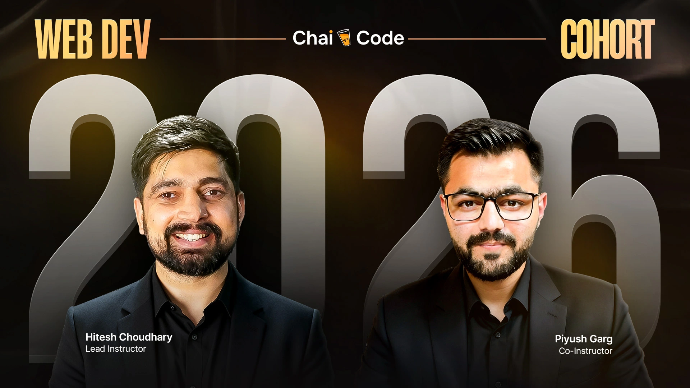

# ☕ Chai Aur Cohort – 2026 (Pre-Cohort Phase)

  

---

### 📌 Status
**Cohort Preparation Repository**

### 📅 Cohort Start Date
**January 17, 2026**

---

## 📖 Introduction

**Chai Aur Cohort** is a full-stack web development cohort led by
**Hitesh Choudhary Sir** and **Piyush Garg Sir**.

This repository is created before the official cohort begins and is intended purely for **pre-cohort preparation and foundational discipline**.

The focus at this stage is:

- Mindset development
- Consistency building
- Documentation habits
- Learning readiness

This stage does **not focus on advanced technical implementation**.

---

## 🎯 Purpose of This Repository

- Prepare mentally and structurally for the cohort
- Practice clean documentation and repository organization
- Build discipline around version control and consistency
- Maintain notes, learning references, and preparation material
- Enter the cohort with clarity and confidence

---

## 📂 Documentation Structure

This repository will gradually evolve and may include:

### 📝 Notes
Conceptual understanding and learning summaries

### 💻 Assignments
Practice exercises *(once the cohort begins)*

### 🚀 Projects
Hands-on applications of learned concepts

### ✍ Blogs / Learnings
Personal reflections and insights

> Structure will mature as the cohort progresses.

---

## 🤝 Contribution Guidelines

Suggestions and improvements are welcome.
Please refer to **CONTRIBUTING.md** for contribution standards and workflow.

---

## 📜 License

This repository is licensed under the **MIT License**.

You are free to:

- Learn from it
- Fork it
- Build upon it
- Share it responsibly

---

⭐ If you find this repository helpful, feel free to **star it**.
